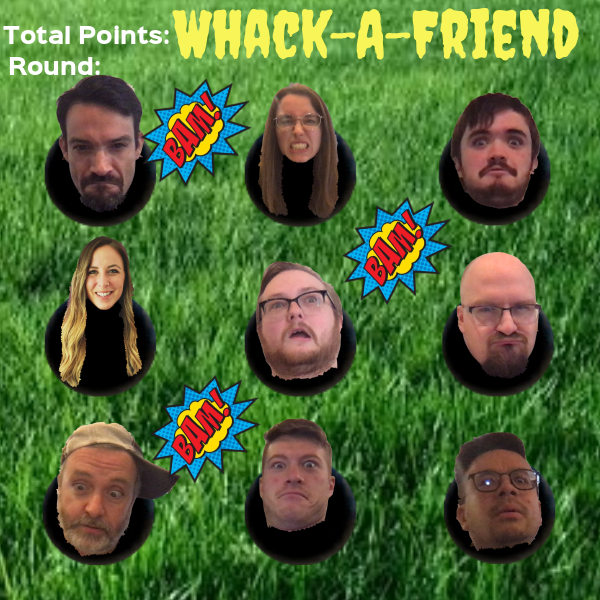

# whackAFriend

OBJECTIVE:

-The objective of this game is to click on as many faces as possible during the time given in each round. The game will have 3 rounds! Challenge yourself or others to get a higher score! 

USER STORIES: 

-When the user clicks begin, the timer should start and faces should randomly start popping up and disappearing quickly from the holes displayed on the screen. 

-For each click(on a face), you should receive a point added in total points

-In round 1, the player will have 20 seconds to click on the faces. The faces will not disappear as fast in this round.

-In round 2, the player will have 15 seconds and the faces will start disappearing quicker

-In round 3, the player will have 10 seconds and the faces will disappear quicker than previous rounds.

-When each round is over, the timer should be updated for the user to continue playing, while becoming more difficult

-At the end round 3, the total points should be displayed

